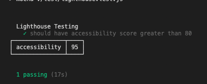

# Lighthouse Accessibility Testing Demo

### RUN TESTS

1. Run `npm i`
2. Run `npm test`

You can find more about the available configuration here :
https://github.com/GoogleChrome/lighthouse/blob/master/docs/configuration.md

